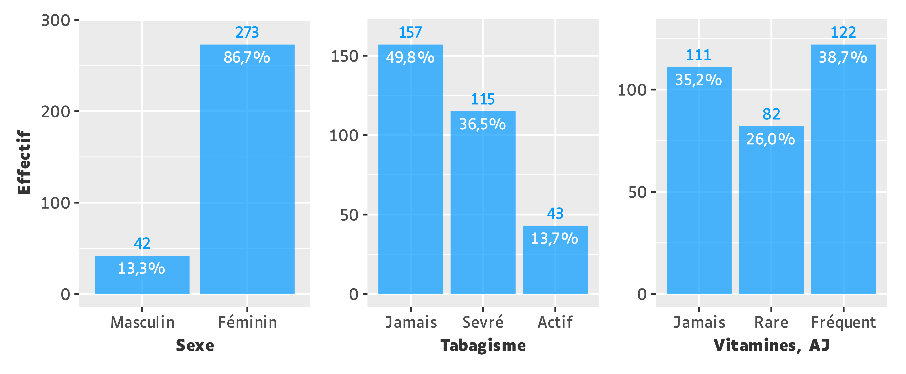
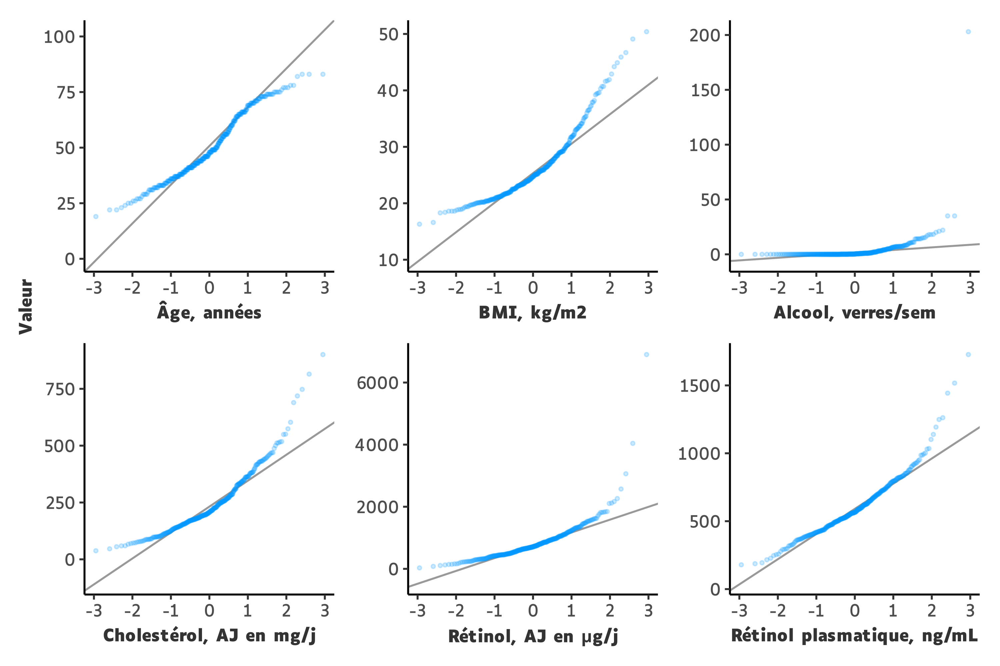
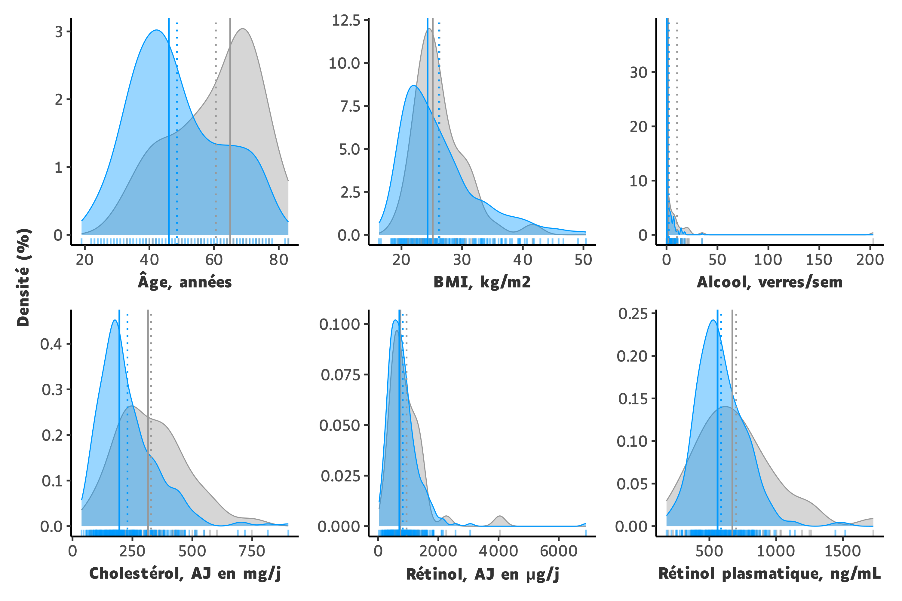
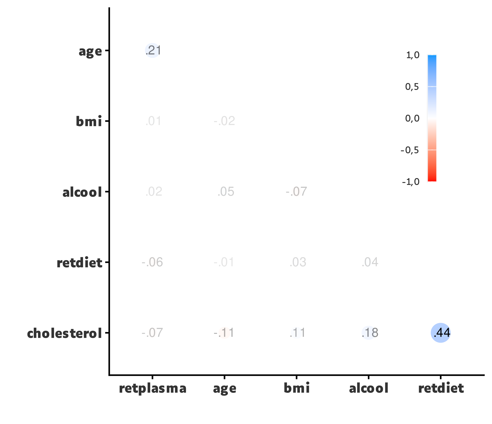

```{r}
#| label: setup
#| include: false

library(knitr)
library(gt)

quiet <- TRUE

source("scripts/_setup.R")

auto_exec()

.pal <- opts$palette

.acro <- \(vars) {

  acro_match(
    x = df,
    vars = vars,
    acro_list = opts$acro,
    acro_sep = opts$sep$ext
  )

}
```

# Énoncé {.unnumbered .unlisted}

###### **Objectif**

À partir du jeu de données `retinol.csv`, rechercher les relations existant entre la concentration plasmatique en rétinol d'une part, et d'autre part, l'âge, le sexe, le BMI, la consommation de tabac et d'alcool, l'apport alimentaire en vitamines, cholestérol et rétinol.

###### **Étapes**

1.  Décrire les variables.
2.  Étudier les relations existant entre les paires de variables.
3.  Produire un modèle de régression linéaire expliquant la concentration plasmatique en rétinol, et rechercher des interactions entre les variables explicatives. Même chose avec un modèle de régression logistique (après dichotomisation de la variable à expliquer sur la médiane).

::: callout-note
# Note

L'ensemble du code est divisé en 2 types de scripts :

- Préparation des données (`_setup.R`)
- Production des tableaux et figures (`tbl_*.R` ou `fig_*.R`)

Les paramètres et objets définis dans `_setup.R` sont injectés dans les scripts tableaux et figures, exécutés en aval, afin d'éviter toute duplication de code.

Les tableaux et figures numérotés sont précédés de leur script respectif (replié par défaut). Si plusieurs éléments sont produits par un même script, celui-ci est placé soit uniquement devant le premier élément, soit placé à plusieurs reprises avec une numérotation.

L'ensemble du matériel est accessible depuis un dépôt git en cliquant sur [</> Code]{.nb} en haut à droite de la page.

Aucun large language model n'est utilisé pour la rédaction du code ou du texte.
:::

::: callout-important
# Le contenu de ce devoir n'est pas corrigé
:::

::: {add-from=scripts/_setup.R code-line-numbers="true" code-filename="_setup.R"}
```r
```
:::

# Description des variables

## Recodage

Ci-dessous un aperçu du jeu de données `retinol.csv` :

```{r}
read_csv2("data/retinol.csv") |> glimpse()
```

Il y avait **315 observations**, sans données manquantes. Sur les **14 variables**, **9** ont été sélectionnées et recodées de la manière suivante :

```{r}
easy_view(df)$output
```

## Variables qualitatives

On dénombrait **3 variables qualitatives**.

::: {add-from=scripts/fig_ql.R code-line-numbers="true" code-filename="fig_ql.R"}
```r
```
:::

```{r}
#| label: fig-ql
#| out-width: 85%
#| fig-cap: !expr '.title_ql'

.title_ql <-
str_fig(title = "Caractéristiques des variables qualitatives.",
        acro = .acro(opts$data$ql$vars),
        qmd = TRUE)


```

## Variables quantitatives

On dénombrait **6 variables quantitatives**.

::: {add-from=scripts/tbl_qt.R code-line-numbers="true" code-filename="tbl_qt.R"}
```r
```
:::

```{r}
#| label: tbl-qt
#| tbl-cap: Caractéristiques des variables quantitatives.

tbl_qt
```

La normalité de ces variables pouvait être évaluée de manière très approximative à l'aide de Q-Q plots.

::: {add-from=scripts/fig_qq.R code-line-numbers="true" code-filename="fig_qq.R"}
```r
```
:::

```{r}
#| label: fig-qq
#| out-width: 85%
#| fig-cap: !expr '.title_qq'
#| lightbox:
#|   group: fig-qt

.title_qq <-
str_fig(title = "Diagrammes Q-Q.",
        note =
          glue("Distribution {str_color('théorique', .pal[1])} en abscisses,
               distribution {str_color('observée', .pal[2])} en ordonnées."),
        acro = .acro(opts$data$qt$vars$total),
        qmd = TRUE)


```

::: callout-important
# Important

Au vu des Q-Q plots il n'était pas facile de conclure formellement à la normalité des variables. Cependant pour la faisabilité de l'exercice, on a considéré que celles-ci avaient bien une distribution approximativement normale lorsque c'était nécessaire, **en conservant toutefois le calcul de la médiane au profit de la moyenne**.
:::

Les variables quantitatives ont été décrites graphiquement à l'aide de leur fonction de densité.
Une stratification sur la variable `sexe` a été réalisée à titre exploratoire.

::: {add-from=scripts/fig_dty.R code-line-numbers="true" code-filename="fig_dty.R"}
```r
```
:::

```{r}
#| label: fig-dty
#| out-width: 85%
#| fig-cap: !expr '.title_dty'
#| lightbox:
#|   group: fig-qt

.title_dty <-
str_fig(title =
          glue("Densité de fréquence des variables quantitatives chez les
               {str_color('hommes', .pal[1])} et les {str_color('femmes', .pal[2])}."),
        note =
          glue("Les moyennes sont représentées par les traits en pointillés,
               les médianes par les traits pleins."),
        acro = .acro(opts$data$qt$vars$total),
        qmd = TRUE)


```

Cette stratification permettait de constater une répartition plutôt hétérogène des modalités de la variable `sexe`.
Le sexe féminin étant représenté a plus de 85%, la densité globale des différentes variables quantitatives (non représentée) pouvait s'apparenter à la densité spécifique de cette modalité.

::: callout-important
# Gestion des valeurs extrêmes
Aussi bien graphiquement qu'avec les résultats numériques, on pouvait observer la présence d'une valeur particulièrement extrême dans la variable `alcool`.
Aucune supposition n'a été faite sur la nature de cette valeur et il a été décidé de **ne pas** la supprimer du jeu de données.
:::

# Relations entre paires de variables

## Quanti-Quanti

Les relations entre variables quantitatives deux-à-deux pouvaient être étudiées avec le calcul du **coefficient de corrélation linéaire de Pearson**.

::: {add-from=scripts/fig_corr.R code-line-numbers="true" code-filename="fig_corr.R"}
```r
```
:::

```{r}
#| label: fig-corr
#| out-width: 60%
#| fig-cap: Coefficients de corrélation de Pearson calculés entre chaque paire de variables quantitatives.


```

Par souci de légèreté on s'est focalisé sur les 3 corrélations qui apparaissaient comme étant les plus éloignées de 0. Elles sont présentées ci-dessous, accompagnées du résultat du **test de nullité** :

```{r}
#| echo: true

df |>
  correlate() |>
  stretch(remove.dups = TRUE) |>
  mutate(r = round(r, 2),
         p.value =
           map2_dbl(x, y, ~ cor.test(df[[.x]], df[[.y]])$p.value) |>
             style_pvalue()) |>
  arrange(desc(r)) |>
  head(n = 3) |>
  gt_qmd() |>
  tab_style(style = cell_text(align = "right"),
            locations = cells_body(p.value))
```

\

Chacun de ces coefficients de corrélation linéaire étaient positifs et statistiquement différents de 0 au risque $\alpha$ = 5%.

::: callout-note
# Interprétation

Il existait une relation linéaire positive entre :

- L'apport journalier en cholestérol et l'apport journalier en rétinol
- L'apport journalier en cholestérol et la consommation d'alcool
- L'âge et la concentration plasmatique en rétinol
:::

::: callout-important
# Significativité statistique vs. pertinence

Ces corrélations étaient statistiquement significatives au risque $\alpha$ = 5%. Toutefois il est utile de rappeler qu'elles étaient objectivement faibles à modérées (r < 0,5) et que cette significativité ne présuppose en rien de la taille de l'effet.
:::

## Quali-Quali et Quali-Quanti

Les relations restantes ont été regroupées, pour chaque variable qualitative, afin de ne pas multiplier les tableaux.

Les relations entre variables qualitatives deux-à-deux étaient étudiées avec un test du **Chi2 d'indépendance**.

::: callout-note
# Condition d'application

Les effectifs théoriques sont présentés ci-dessous :

```{r}
#| echo: true

.chisq <-
lst(vars = combn(opts$data$ql$vars, 2),
    expected =
      map2(.x = vars[1, ] |> set_names(glue("{vars[1, ]}-{vars[2, ]}")),
           .y = vars[2, ],
           ~ chisq.test(df[[.x]], df[[.y]], correct = FALSE) |>
             pluck("expected") |>
             round(1)))
```

```{r}
.chisq
```

Aucun effectif théorique n'était inférieur à 5, on pouvait donc appliquer un **Chi2 sans correction**.
:::

Les relations entre variables qualitatives et quantitatives étaient étudiées de la façon suivante :

-   Variable `sexe` : test de **Wilcoxon** (on comparait 2 médianes, échantillons indépendants).
-   Variables `tabac` et `vitamine` : test de **Kruskal-Wallis** (on comparait des médianes sur une variable qualitative ayant plus de 2 modalités, échantillons indépendants).

```{r}
.title_bv <-
list(sexe = "du sexe.",
     tabac = "du tabagisme.",
     vitamine = "de l'apport journalier en vitamines.") |>
  map(~ glue("Caractéristiques des variables en fonction {.}"))
```

::: {add-from=scripts/tbl_bv.R code-line-numbers="true" code-filename="tbl_bv.R"}
```r
```
:::

```{r}
#| label: tbl-bv-sexe
#| tbl-cap: !expr '.title_bv$sexe'

tbl_bv.sexe
```

```{r}
#| label: tbl-bv-tabac
#| tbl-cap: !expr '.title_bv$tabac'

tbl_bv.tabac
```

```{r}
#| label: tbl-bv-vitamine
#| tbl-cap: !expr '.title_bv$vitamine'

tbl_bv.vitamine
```

### Quali-Quali

Les associations `sexe` ~ `tabac` et `sexe` ~ `vitamine` étaient statistiquement significatives au risque $\alpha$ = 5%, (respectivement p = 0,028 et p = 0,004).

::: callout-note
## Interprétation

Le tabagisme et l'apport alimentaire journalier en vitamines n'étaient pas indépendants du sexe.
:::

### Quali-Quanti

Les associations statistiquement significatives au risque $\alpha$ = 5% étaient :

Sexe (comparaison de 2 médianes)
: - `sexe` ~ `age` [(p < 0,001)]{.sm-em}
- `sexe` ~ `cholesterol` [(p < 0,001)]{.sm-em}
- `sexe` ~ `retplasma` [(p = 0,022)]{.sm-em}

Tabagisme (comparaison de plus de 2 médianes)
: - `tabac` ~ `alcool` [(p < 0,001)]{.sm-em}
- `tabac` ~ `retplasma` [(p = 0,035)]{.sm-em}

Apport journalier en vtamines (comparaison de plus de 2 médianes)
: - `vitamine` ~ `age` [(p < 0,005)]{.sm-em}
- `vitamine` ~ `alcool` [(p < 0,039)]{.sm-em}

::: callout-note
# Interprétation

Les femmes étaient plus jeunes, avaient un apport alimentaire journalier en cholestérol et une concentration plasmatique en rétinol plus faibles comparé aux hommes.

L'âge, la consommation d'alcool et la concentration plasmatique en rétinol n'étaient pas également répartis selon le statut tabagique.

L'âge et la consommation d'alcool n'étaient pas également répartis selon l'apport journalier en vitamines.
:::

# Modèles de régression

## Régression linéaire

L'objectif était d'expliquer la variation de la concentration plasmatique en rétinol (variable quantitative continue) à l'aide des autres variables.

Nous avons choisi de procéder en 2 temps :

1. Analyse univariable
: Réalisation d'une régression linéaire simple avec chaque variable explicative.

2. Analyse multivariable
: Régression linéaire multiple en prenant comme variables explicatives les variables statistiquement significatives au risque $\alpha$ = 5% en régression linéaire simple.

::: callout-note
# Conditions d'application

On a pu vérifier que la distribution des résidus était approximativement normale (non représentée).

La recherche des distances de Cook (non présentables) a permis de détecter **4 observations influentes**. Il y avait bien une différence dans les résultats en fonction leur retrait ou non du jeu de données, elles ont donc été retirées.

Au total on avait alors 315-4 = **311 observations** sans données manquantes.
:::

Les résultats sont regroupées dans le tableau suivant.

::: {add-from=scripts/tbl_lm.R code-line-numbers="true" code-filename="tbl_lm.R"}
```r
```
:::

```{r}
#| label: tbl-lm
#| tbl-cap: Modèles univariable et multivariable de régression linéaire expliquant la variation de la concentration plasmatique en rétinol (ng/mL).

tbl_lm
```

Dans un modèle de régression linéaire simple, les coefficents de régression des variables `age`, `sexe`, `tabac` et `alcool` étaient statistiquement différents de 0, au risque $\alpha$ = 5%.

Le modèle de régression linéaire multiple montrait que cette différence, après ajustement, ne persistait pas pour les variables `sexe` et `tabac`.

::: callout-note
# Interpréation

Chez les individus de même sexe, à statut tabagique et consommation d'alcool identiques, la concentration plasmatique en rétinol augmentait en moyenne de 2,9 ng/mL par année de vie supplémentaire.

Chez les individus de même âge et de même sexe, et à statut tabagique identique, chaque verre d'alcool supplémentaire consommé par semaine était associé à une augmentation moyenne de la concentration en rétinol de 7,2 ng/mL.

Le sexe et le statut tabagique n'étaient pas des facteurs indépendants de variation de la concentration plasmatique en rétinol.
:::

::: callout-important
# Significativité statistique vs. pertinence

Le R² ajusté était égal à 0,09, ce qui revenait à dire que l'âge et la consommation d'alcool ne pouvaient expliquer que **9% de la variation totale** de la concentration plasmatique en rétinol.
Malgré la significativité statistique il était donc nécessaire de relativiser de tels résultats.
:::

Aucune interaction statistiquement significative au risque $\alpha$ = 5% n'a été retrouvée entre les variables explicatives.

## Régression logistique

Afin de pouvoir être utilisée comme variable à expliquer dans un modèle logistique, la variable `retplasma` a été dichotomisée sur sa médiane (566 ng/mL). Elle prenait la valeur [0]{.dig} si inférieure, ou la valeur [1]{.dig} si supérieure ou égale.

On avait donc un modèle de régression logistique avec 50% d'évènements (["retplasma == 1"]{.str} : n = 155 sur 311 observations sans données manquantes).

::: callout-note
# Condition d'application

Le modèle était composé de 8 variables explicatives, dont 2 ayant 2 modalités (`tabac` et `vitamine`), soit un équivalent de **10 variables explicatives**.

Avec un nombre théorique maximal de 10 évènements par variable explicative on obtenait 10 * 10 = **100 évènements**.

Le nombre réel d'évènements était > 100, on pouvait ainsi considérer le modèle valide.
:::

::: callout-important
# Note sur le modèle multivariable

De façon arbitraire, nous avons choisi d'inclure dans l'analyse multivariable les variables explicatives du modèle de régression linéaire multiple.
:::

Les résultats sont regroupées dans le tableau suivant.

::: {add-from=scripts/tbl_glm.R code-line-numbers="true" code-filename="tbl_glm.R"}
```r
```
:::

```{r}
#| label: tbl-glm
#| tbl-cap: Modèles univariable et multivariable de régression logistique expliquant une concentration plasmatique en rétinol ≥ 566 ng/mL.

tbl_glm
```

Dans un modèle de régression logistique simple, les odds ratio correspondant aux variables `age` et `alcool` étaient statistiquement différents de 1, au risque $\alpha$ = 5%.

Le modèle de régression linéaire multiple montrait une persistance de ces différences après ajustement.

::: callout-note
# Interprétation

Chez les individus de même sexe, à statut tabagique et consommation d'alcool identiques, la probabilité d'avoir une concentration plasmatique en rétinol supérieure ou égale à 566 ng/mL était majorée de 3% en moyenne avec chaque année de vie supplémentaire.

Chez les individus de même âge et de même sexe, et à statut tabagique identique, chaque verre d'alcool supplémentaire consommé par semaine augmentait de 7% en moyenne la probabilité d'avoir une concentration plasmatique en rétinol supérieure ou égale à 566 ng/mL.
:::

Aucune interaction statistiquement significative au risque $\alpha$ = 5% n'a été retrouvée entre les variables explicatives.

# Session {.unnumbered .unlisted}

```{r}
devtools::session_info(pkgs = "attached")
```
